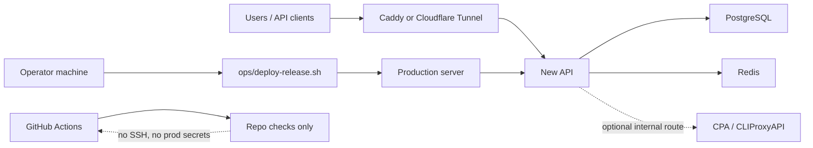

# Lihan AI Relay

[Chinese README](README.zh-CN.md) | [User Quickstart](docs/user-quickstart.md) | [Maintainer Runbook](docs/maintainer-release-runbook.md) | [Contributing](CONTRIBUTING.md)

Lihan AI Relay is a lightweight, production-minded operations wrapper for running an AI API relay on top of [New API](https://github.com/QuantumNous/new-api). It keeps the upstream application intact and focuses this repository on deployment, backup, restore, release safety, local E2E checks, and operator documentation.

The default runtime uses the official `calciumion/new-api:latest` image. The pinned `vendor/new-api` and `vendor/cli-proxy-api` submodules are kept for verification, upgrade review, emergency patching, and rollback.

## Project Positioning

This repository is for small, trusted deployments that need a clear and repeatable way to operate New API in production.

It is designed for:

- Self-hosted New API deployment with Docker Compose.
- Manual, operator-controlled production promotion.
- Local PostgreSQL backup, verification, restore drills, and rollback.
- Small-circle or private-beta AI API relay operations.
- Lightweight CI that validates the repository without touching production secrets.

It is not designed for:

- Public SaaS automation or open registration at scale.
- A forked New API product surface.
- Fully automated GitHub-to-production deployment.
- A promise of unlimited usage, lowest price, official USD balance, or hard SLA.

## What Is Included

- Docker Compose topology for New API, PostgreSQL, Redis, Caddy, optional Cloudflare Tunnel, and optional internal CPA / CLIProxyAPI.
- `ops/relayctl.sh`, a small command wrapper for status, maintenance, release checks, deployment, recovery, rollback, and local E2E.
- Remote release flow: `prepare -> smoke -> promote -> status`.
- Backup and restore scripts with verification and restore drills.
- Local Playwright E2E for the core New API smoke path and admin user-management dropdown path.
- No-secret GitHub Actions checks for PRs and post-merge validation.
- User docs, maintainer docs, contribution rules, and security guidance.

## Architecture



Production promotion is intentionally manual. GitHub Actions validates the repository, but it does not SSH into the server and does not need production secrets.

## Quick Start

Use WSL Ubuntu 24.04, Linux, or a Linux VPS shell.

```bash
git clone https://github.com/lihan3238/lihan_ai.git
cd lihan_ai
git submodule update --init --recursive

cp .env.production.example .env.production
# Replace every CHANGE_ME value and set DOMAIN.

ENV_FILE=.env.production bash ops/preflight.sh
docker compose --env-file .env.production -f docker-compose.yml -f docker-compose.prod.yml up -d
```

Then open `https://$DOMAIN`, create the first New API admin account, and finish provider, model, group, quota, and billing configuration in the New API admin console.

For a local restored test stack and browser E2E, use:

```bash
bash ops/relayctl.sh local-e2e
```

## Daily Operations

Run these on the production server:

```bash
cd /opt/lihan_ai_deploy/current
ENV_FILE=.env.production bash ops/relayctl.sh status
ENV_FILE=.env.production bash ops/relayctl.sh maintain
```

`maintain` runs verified PostgreSQL backup, storage pruning, and runtime health checks.

## Release Flow

Run from the operator machine after `main` is ready:

```bash
git fetch origin
git switch main
git pull --ff-only origin main

bash ops/relayctl.sh release-check

DEPLOY_HOST=<deploy-user>@<origin-host> bash ops/relayctl.sh deploy-prepare
DEPLOY_HOST=<deploy-user>@<origin-host> bash ops/relayctl.sh deploy-smoke
DEPLOY_HOST=<deploy-user>@<origin-host> bash ops/relayctl.sh deploy-promote
DEPLOY_HOST=<deploy-user>@<origin-host> bash ops/relayctl.sh deploy-status
```

If promotion is interrupted:

```bash
DEPLOY_HOST=<deploy-user>@<origin-host> bash ops/relayctl.sh deploy-status
DEPLOY_HOST=<deploy-user>@<origin-host> bash ops/relayctl.sh recover
```

Rollback remains explicit:

```bash
DEPLOY_HOST=<deploy-user>@<origin-host> bash ops/relayctl.sh rollback <release-id>
```

## Documentation

- [User quickstart](docs/user-quickstart.md): short setup path for invited users.
- [User guide](docs/user-guide.md): fuller client and API usage notes.
- [Maintainer release runbook](docs/maintainer-release-runbook.md): stable production release path.
- [Browser E2E runbook](docs/browser-e2e-runbook.md): local and production browser verification.
- [Small-circle launch runbook](docs/new-api-small-circle-launch-runbook.md): private-beta New API configuration.
- [Small-circle promo ops](docs/new-api-small-circle-promo-ops.md): site copy, group operations, and support templates.
- [Chinese docs](docs/zh-CN/): synchronized Chinese runbooks.

## Repository Layout

```text
.
|-- docker-compose*.yml       # Runtime topologies and optional overlays
|-- ops/                      # Deployment, backup, restore, validation, E2E wrappers
|-- tests/                    # Shell tests for operational behavior
|-- e2e/                      # Playwright checks for core New API paths
|-- docs/                     # User and maintainer documentation
|-- config/ops-profiles/      # Read-only New API configuration validation profiles
|-- vendor/new-api/           # Pinned upstream New API submodule
|-- vendor/cli-proxy-api/     # Pinned upstream CLIProxyAPI submodule
```

Runtime data, logs, backups, snapshots, local env files, and private AI working notes are intentionally ignored by Git.

## Verification

GitHub Actions PR CI lives in `.github/workflows/ci.yml` and runs repository checks without production secrets.

Fast local checks:

```bash
bash ops/pre-commit.sh
```

Full repository gate:

```bash
bash ops/dev-gate.sh
```

Formal release gate:

```bash
bash ops/release-readiness.sh
```

The formal gate includes local New API E2E by default. Use `SKIP_LOCAL_E2E=1` only with a written reason in the PR or release handoff.

For feature work, document skipped browser or API paths in an `E2E Coverage Matrix` with `Reason:` and `Rerun:` notes.

Production backup details live in the runbooks; the scheduled entry point is `ops/backup-cron.sh`.

## Community

Small, focused PRs are welcome. Please read [CONTRIBUTING.md](CONTRIBUTING.md) before opening a PR, keep production-specific details out of commits, and do not include secrets, private backups, local runtime data, or generated Playwright artifacts.

Security reports should follow [SECURITY.md](SECURITY.md).
