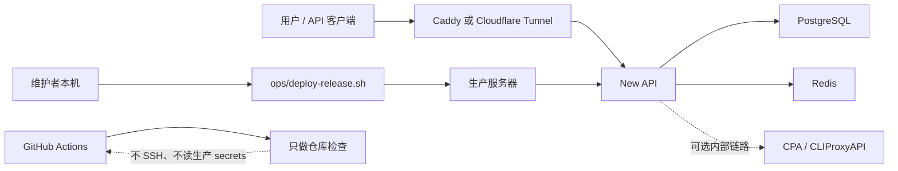

# Lihan AI Relay

[English README](README.md) | [用户快速接入](docs/zh-CN/user-quickstart.md) | [维护者发布手册](docs/zh-CN/maintainer-release-runbook.md) | [贡献说明](CONTRIBUTING.md)

Lihan AI Relay 是一个围绕 [New API](https://github.com/QuantumNous/new-api) 的轻量生产运维 wrapper。它不改造上游产品本体，而是把本仓库聚焦在部署、备份、恢复、发布门禁、本机 E2E 和运维文档上。

默认运行时使用官方 `calciumion/new-api:latest` 镜像。仓库里的 `vendor/new-api` 和 `vendor/cli-proxy-api` submodule 只作为验证、升级审查、紧急补丁和回滚路径保留。

## 项目定位

这个仓库面向小范围、可信任、需要稳定运维路径的 New API 生产部署。

适合：

- 用 Docker Compose 自托管 New API。
- 由维护者手动控制生产发布。
- 本地 PostgreSQL 备份、校验、恢复演练和回滚。
- 熟人内测、小范围 AI API relay 运营。
- 不接触生产 secrets 的轻量 CI 检查。

不适合：

- 大规模公开 SaaS 自动化获客。
- fork New API 做一套新产品前端。
- GitHub Actions 全自动控制生产服务器。
- 承诺无限量、最低价、官方 USD 余额或强 SLA。

## 包含什么

- New API、PostgreSQL、Redis、Caddy、可选 Cloudflare Tunnel、可选内部 CPA / CLIProxyAPI 的 Docker Compose 拓扑。
- `ops/relayctl.sh` 薄封装入口：状态检查、维护、发布检查、部署、恢复、回滚、本机 E2E。
- 远端发布流程：`prepare -> smoke -> promote -> status`。
- 带校验和恢复演练的备份/恢复脚本。
- 覆盖核心 New API smoke 路径和后台用户管理 dropdown 路径的本机 Playwright E2E。
- 不需要 secrets 的 GitHub Actions PR 检查和合并后验证。
- 用户文档、维护者文档、社区贡献规则和安全说明。

## 架构



生产 promote 故意保持人工执行。GitHub Actions 只验证仓库，不 SSH 到服务器，也不需要生产 secrets。

## 快速开始

使用 WSL Ubuntu 24.04、Linux 或 Linux VPS shell。

```bash
git clone https://github.com/lihan3238/lihan_ai.git
cd lihan_ai
git submodule update --init --recursive

cp .env.production.example .env.production
# 替换所有 CHANGE_ME，并设置 DOMAIN。

ENV_FILE=.env.production bash ops/preflight.sh
docker compose --env-file .env.production -f docker-compose.yml -f docker-compose.prod.yml up -d
```

然后打开 `https://$DOMAIN`，创建第一个 New API 管理员账号，并在 New API 后台完成供应商、模型、分组、额度和计费配置。

本地恢复栈和浏览器 E2E 使用：

```bash
bash ops/relayctl.sh local-e2e
```

## 日常运维

在生产服务器执行：

```bash
cd /opt/lihan_ai_deploy/current
ENV_FILE=.env.production bash ops/relayctl.sh status
ENV_FILE=.env.production bash ops/relayctl.sh maintain
```

`maintain` 会执行已校验的 PostgreSQL 备份、存储清理和运行时健康检查。

## 发布流程

`main` 准备好后，从维护者本机执行：

```bash
git fetch origin
git switch main
git pull --ff-only origin main

bash ops/relayctl.sh release-check

DEPLOY_HOST=<deploy-user>@<origin-host> bash ops/relayctl.sh deploy-prepare
DEPLOY_HOST=<deploy-user>@<origin-host> bash ops/relayctl.sh deploy-smoke
DEPLOY_HOST=<deploy-user>@<origin-host> bash ops/relayctl.sh deploy-promote
DEPLOY_HOST=<deploy-user>@<origin-host> bash ops/relayctl.sh deploy-status
```

如果 promote 过程中 SSH 中断：

```bash
DEPLOY_HOST=<deploy-user>@<origin-host> bash ops/relayctl.sh deploy-status
DEPLOY_HOST=<deploy-user>@<origin-host> bash ops/relayctl.sh recover
```

回滚保持显式执行：

```bash
DEPLOY_HOST=<deploy-user>@<origin-host> bash ops/relayctl.sh rollback <release-id>
```

## 文档

- [用户快速接入](docs/zh-CN/user-quickstart.md)：给内测用户的最短接入路径。
- [用户详细指南](docs/zh-CN/user-guide.md)：更完整的客户端和 API 使用说明。
- [维护者发布手册](docs/zh-CN/maintainer-release-runbook.md)：稳定生产发布路径。
- [浏览器 E2E 手册](docs/browser-e2e-runbook.md)：本机和生产浏览器验证。
- [熟人内测配置手册](docs/zh-CN/new-api-small-circle-launch-runbook.md)：New API 后台配置。
- [熟人内测宣发运营](docs/zh-CN/new-api-small-circle-promo-ops.md)：站内文案、群运营和支持模板。
- [English docs](docs/)：英文 runbook。

## 仓库结构

```text
.
|-- docker-compose*.yml       # 运行拓扑和可选覆盖
|-- ops/                      # 部署、备份、恢复、验证、E2E 封装
|-- tests/                    # 运维行为 shell 测试
|-- e2e/                      # New API 核心路径 Playwright 检查
|-- docs/                     # 用户和维护者文档
|-- config/ops-profiles/      # 只读 New API 配置验收 profile
|-- vendor/new-api/           # 固定版本的上游 New API submodule
|-- vendor/cli-proxy-api/     # 固定版本的上游 CLIProxyAPI submodule
```

运行时数据、日志、备份、快照、本地 env 文件和私有 AI 工作笔记都会被 Git 忽略。

## 验证

GitHub Actions PR CI 位于 `.github/workflows/ci.yml`，只运行不需要生产 secrets 的仓库检查。

快速本地检查：

```bash
bash ops/pre-commit.sh
```

完整仓库门禁：

```bash
bash ops/dev-gate.sh
```

正式发布门禁：

```bash
bash ops/release-readiness.sh
```

正式发布门禁默认包含本机 New API E2E。只有在 PR 或发布交接里写明原因时，才使用 `SKIP_LOCAL_E2E=1`。

做功能开发时，跳过的浏览器或 API 路径要写进 `E2E Coverage Matrix`，并补充 `Reason:` 和 `Rerun:`。

生产备份细节见 runbook；定时任务入口是 `ops/backup-cron.sh`。

## 社区

欢迎小而聚焦的 PR。提交前请阅读 [CONTRIBUTING.md](CONTRIBUTING.md)，不要提交生产细节、secrets、私有备份、本地运行数据或 Playwright 生成产物。

安全问题请按 [SECURITY.md](SECURITY.md) 反馈。
